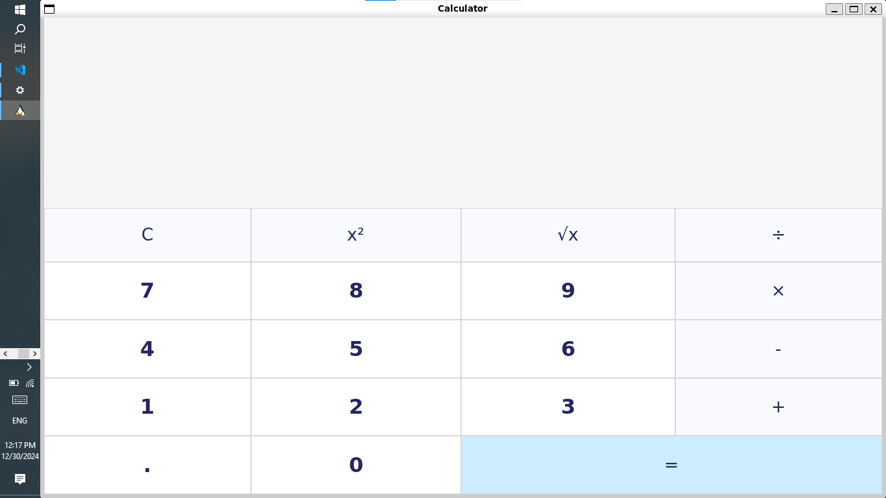

# Calculator

- I Created my own Calculator App in Python and tkinter framework.

---

# Learning Objectives

## Programming Fundamentals

1. Object-Oriented Programming (OOP):
    * Understanding classes and objects (e.g., the `Calculator` class).
    * Defining and using class methods (e.g., `__init__`, `create_buttons`, `add_to_expression`).
    * Encapsulation of data and behavior within the class.
2. Variables and Data Types:
    * Declaring and using variables (e.g., `total_expression`, `current_expression`).
    * Working with string data types for handling expressions.
3. Control Flow:
    * Using loops (e.g., `for` loop in `create_digit_buttons`) to iterate over collections.
    * Conditional statements (if/else) for handling different operations (optional, for more advanced calculators).
4.Functions:
    * Defining and calling functions (e.g., `add_to_expression`, `append_operator`, `evaluate`).
    * Understanding function parameters and return values.
    * Using lambda functions for concise event handling.

5.GUI Development with Tkinter
    *Creating GUI Windows:**
    - Using `tk.Tk()` to create the main application window.
    - Configuring window properties (e.g., size, title, resizability).
6. Working with Widgets:
    * Creating and configuring various widgets (e.g., `tk.Label`, `tk.Button`, `tk.Frame`).
    * Understanding widget properties (e.g., text, font, color, background).
    * Arranging widgets using layout managers (e.g., `grid` layout).
7. Event Handling:**
    * Binding events to widgets (e.g., button clicks).
    * Handling events using lambda functions or separate event handler functions.

8. Application Logic

    *Managing User Input:*
    - Handling user input from buttons (digits, operators).
    - Building and updating the expression string.
9. Performing Calculations:
    * Implementing the logic for basic arithmetic operations (+, -, *, /).
    * Handling potential errors (e.g., division by zero).
10. Displaying Results:
    * Updating the display to show the current expression and the calculation result.

By completing this project, I have gained practical experience in these areas, developed my problem-solving skills, and learn how to create interactive and user-friendly applications using Python and Tkinter.

## How to Run Application on your local Machine
 - Clone this Repo to local machine
 - Run:

$ python3 calculator.py

